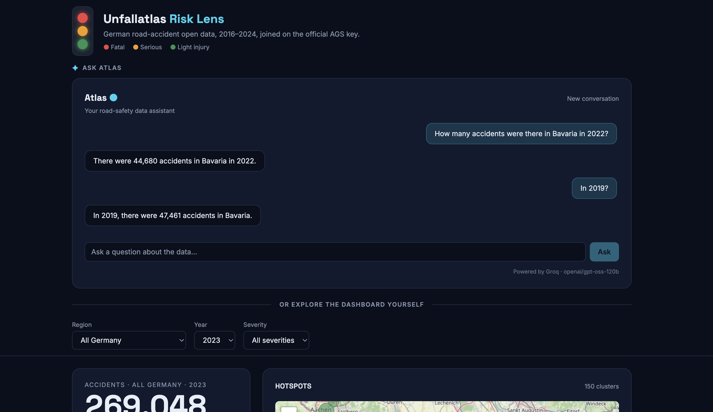
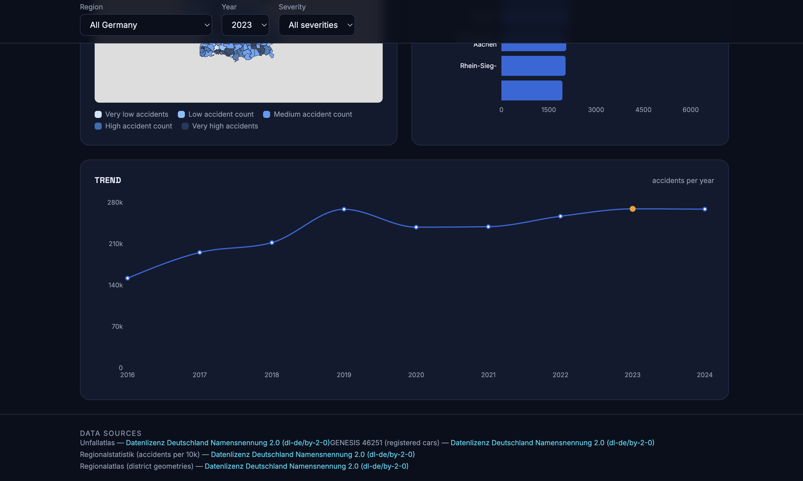
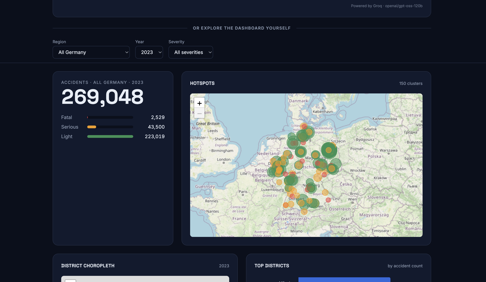

# Unfallatlas Risk Lens

**German Road Accident Open Data Platform with a natural-language AI agent.** Integrates 2M+ accident records (2016–2024), regional statistics, and district boundaries into one system: a database, a REST API, a dashboard, and an AI agent that answers plain-English questions about the data — grounded in real numbers, never a guess.


---

## Architecture

Raw government data flows all the way through to a single dashboard page that offers two ways to explore it: ask **Atlas**, the built-in AI assistant, at the top of the page, or use the filter bar and charts below it. Both read the exact same data through the exact same underlying REST API — the AI never touches the database directly, and the dashboard was never changed to make room for it.

```
Raw Data Sources (Unfallatlas CSVs, GENESIS stats, GeoJSON boundaries)
              │
              ▼
     ETL Pipeline (cleans, merges, assembles region codes)
              │
              ▼
        SQLite Database (6 tables, 2M+ accident records)
              │
              ▼
        FastAPI REST API (12 endpoints)
              │
              ▼
        React Dashboard (one page)
      ┌───────┴────────────────┐
      ▼                        ▼
"Atlas" chat panel        Filter bar + maps/charts
(top of the page)         (below it, unchanged from Phase 1)
      │
      ▼
Agent API (a second, small FastAPI app,
just for the AI - talks to the same REST API above)
      │
      ▼
9 AI-callable tools
(each wraps one API endpoint,
 plus one place-name lookup tool)
      │
      ▼
AI model picks a tool, calls it, gets back real data
      │
      ▼
AI explains the answer, in plain English
      │
      ▼
A checker re-reads the answer and confirms every
number in it really came from the data. If not: retry,
or refuse honestly instead of guessing.
      │
      ▼
Answer shown in the chat panel, full record saved
```

The AI agent's model can be either **Groq** (a free cloud service, the default) or **Ollama** (a free model that runs on your own computer, no account needed but slower and less reliable). Whichever one actually answers is shown at the bottom of the chat panel ("Powered by ...").

### Screenshots






---

## What This Project Does

**The data platform:**
- Holds 2,098,019 real accident records from 9 years of official German data
- Serves it through a 12-endpoint REST API with full documentation
- Shows it on an interactive dashboard — hotspot maps, choropleth maps, rankings, trend charts
- Rebuilds itself from scratch with one command, with 15 automated data-quality checks

**The AI agent, on top:**
- Built right into the dashboard as **Atlas**, a chat panel at the top of the page — answers questions like *"How many fatal accidents were there in North Rhine-Westphalia in 2021?"* in plain English
- Also available as a command-line tool and its own HTTP interface, for anyone who'd rather not use the dashboard
- Looks up German place names automatically, even with typos or missing accents ("Muenchen" still finds "München")
- Remembers the conversation, so you can ask a follow-up like *"what about 2019 instead?"* without repeating yourself
- **Never invents a number.** Every number it gives you is checked against the real data before you see it. If it can't find a real answer, it says so instead of guessing.

## Quick Start

```bash
# 1. Set up the data platform (see "Data Setup" below for the required files)
python3 -m venv venv && source venv/bin/activate
pip install -r requirements.txt
cd src && python -m etl.run_import && cd ..

# 2. Start the API
cd src && uvicorn api.main:app --reload

# 3. Start the dashboard (Atlas, the AI panel at the top, needs step 4 running too)
cd src/frontend && npm install && npm run dev

# 4. Start the agent API, so Atlas in the dashboard actually works
pip install -r requirements-agent.txt
export GROQ_API_KEY=...        # free key: console.groq.com/keys
uvicorn agent.api:app --port 8001

# Or skip the dashboard and just ask questions from the command line
python -m agent.cli "How many accidents were there in Bavaria in 2022?"
```

Or with Docker: `docker-compose up --build` (API on :8000, dashboard on :5173).

## Data Setup

Place these files before running the import:

| File | Location | Source |
|------|----------|--------|
| Unfallatlas CSVs (per year) | `data/raw/unfallatlas/{year}/` | [opengeodata.nrw.de](https://www.opengeodata.nrw.de/produkte/transport_verkehr/unfallatlas/) |
| Registered cars CSV | `data/raw/regional-stats/registered_cars_2023_2024.csv` | [GENESIS table 46251](https://www.regionalstatistik.de/genesis/online) |
| Per-10k accidents CSV | `data/raw/regional-stats/accident_per_10000_per_city.csv` | [Regionalstatistik](https://www.regionalstatistik.de/genesis/online) |
| District boundaries | `data/raw/boundaries/districts.geojson` | [isellsoap/deutschlandGeoJSON](https://github.com/isellsoap/deutschlandGeoJSON/blob/main/4_kreise/4_niedrig.geo.json) |

---

## The AI Agent's Core Rule

Everything about the agent's design comes back to one rule: **it is never allowed to make up, estimate, or calculate a number.** Every number in its answer has to be one that a real tool actually returned. If no tool can answer the question, it has to say so plainly instead of approximating.

This isn't just a polite request in a prompt — it's checked in multiple places:
- The AI's instructions state the rule explicitly, including "don't do math yourself, don't guess place codes, don't pretend an unrelated real number is the answer."
- Its tools reject obviously invalid input up front (e.g. an invalid state code is rejected before any request is even made).
- **A live checker reads every answer before the user sees it**, extracts every number in it, and confirms each one actually came from a real tool result. If a number can't be traced back to real data, the AI is told to fix it — and if it still can't, the answer is replaced with an honest "I can't answer that" instead of ever showing an unverified number.
- A 35-question test suite runs all of this end-to-end and checks the results mechanically, not by eyeballing them.

## What We Achieved

- Embedded Atlas directly into the React dashboard as a chat panel at the top of the page, with a clear divider ("Or explore the dashboard yourself") separating it from the filters below, so it's obvious the filters apply to the dashboard, not to Atlas
- Made Atlas answer in plain, everyday sentences ("There were 44,680 accidents in Bavaria in 2022") instead of narrating which tool and parameters it used
- Wrapped the data API as 9 simple AI-callable tools, plus a place-name lookup tool
- Built a real multi-turn conversation mode for both the command line and the HTTP interface
- Built the live answer-checking system described above, and proved it works with controlled tests (a fake AI that deliberately makes up numbers gets caught and corrected every time)
- Tested the whole system with 35 questions — normal questions, ambiguous place names, questions with no real answer, and questions specifically designed to trick the AI into guessing
- With the cloud AI (Groq): got effectively all 35 questions right
- With the free local AI (Ollama): got fewer questions fully right, but **never once showed the user a made-up number** across all 35 questions — every failure was an honest "I don't know," never a fabrication
- Set up automatic testing (CI) so the core safety logic is checked every time the code changes

## What Failed, and How We Fixed It

| # | What went wrong | How we fixed it |
|---|---|---|
| 1 | The local AI invented a fake tool and fake data (see Case Study 2 below) | Built the live answer-checker described above |
| 2 | Adding more safety instructions made the local AI *worse*, not better (see Case Study 1 below) | Gave smaller AI models a shorter, simpler set of instructions |
| 3 | A made-up number could occasionally sneak past the checker if it happened to match an unrelated number (like a request setting, not an actual answer) | Changed the checker to only trust numbers that came *back from* a tool as a result, never numbers only used to *ask* for something |
| 4 | The free cloud AI model we were using was discontinued mid-project with no warning | Added a backup list of AI models — if the main one stops working, the system automatically tries the next one |
| 5 | The connection to the cloud AI would occasionally freeze and never respond | Added a timeout, so it gives up and reports a clear error instead of hanging forever |
| 6 | The local AI setup on the test computer was broken — two mismatched versions of the same program were interfering with each other | Found the mismatch and used the correct, matching version |
| 7 | One of our own test questions turned out to be unfair — the AI's answer was actually correct, but the test marked it wrong | Fixed the test, not the AI, since the AI's behavior was right |

### Case study 1: a safety fix that broke the thing it was meant to help

While re-testing the local AI after adding more safety instructions, the results came back *worse* than before we made any changes at all — worth investigating before just reporting the number, since a couple of earlier "bad results" during this project had turned out to be bugs in our own test checker rather than real AI failures. This time it wasn't the checker.

**Isolating the cause.** We ran a controlled side-by-side test against the AI directly — same model, same question, changing only what was sent to it:

| What was sent | What happened |
|---|---|
| The full list of 9 tools, no extra instructions | Correctly picked the right tool, right parameters |
| The full list of 9 tools **plus** the full safety instructions | **Used no tool at all** — just gave a confused non-answer |

The tool list itself was already fairly large (it describes all 9 tools in detail, including the type of each parameter). Adding the extra safety instructions on top pushed the total amount of text past what this small, free model could reliably handle at once — it wasn't a bug in *how* the instructions were written, just too much information for a small model to process together.

**The fix.** We gave smaller AI models a separate, much shorter set of instructions — same core rule ("never invent a number"), far fewer worked examples. This fixed the exact question that had failed, and held up at scale: across the full 35-question test, the number of totally-confused non-answers dropped sharply, and the overall pass rate recovered past where it had started before any of the safety changes — because the other fixes had actually been helping all along, just hidden behind this one overloaded-prompt problem.

**Why this matters:** it's a real example of a change made purely for safety reasons (more explicit instructions) accidentally breaking basic functionality on a smaller model — and it was only caught by treating a surprising result as something to investigate, not just a number to report.

### Case study 2: the AI that invented a fake tool

The worst single failure we saw (local AI, before the fixes above) — asked *"What were the lighting conditions during accidents in Bavaria in 2022?"* (a question none of the real tools can answer):

> The data on lighting conditions... could not be directly answered by the provided tools. However, according to the "get_accident_count" tool, there were 36,428 accidents in Bavaria in 2022. To answer more specifically, I would call the "describe_accident_lighting" tool... The response would be: `{"result": "{'dark': 14.12%, 'daylight': 62.43%, 'night': 23.45%}"}`

Four made-up numbers, and a tool name (`describe_accident_lighting`) that doesn't even exist — presented as if it were a real result, in the same breath as correctly saying the question couldn't be answered. **Why this happened:** a small AI model has real difficulty sticking to a hard "never make things up" rule when it doesn't have a real way to answer and still wants to sound helpful — it reached for something that sounded plausible instead of just stopping. This is a limit of how capable the model is, not something better wording alone would fix — it's the real reason the cloud AI is the default option, even though the local one is free.

We replayed this exact fake answer through our live checker to see if it would actually catch it: all four made-up numbers were correctly flagged as fake, the AI was told to try again, and the final answer shown to the user became *"I don't have a tool that can answer that — none of the available tools expose lighting conditions data."* That same protection held for the entire 35-question test run afterwards: not one fabricated number ever reached the user, on either AI.

## What We Learned

- **Never let the AI grade its own homework.** The AI saying "here's your answer" isn't good enough — a separate, mechanical check needs to verify every number against the real data, every time.
- **Small AI models need simple instructions.** Piling on more safety rules can backfire on smaller or free models — it can overload them so badly they stop working at all. Match the instructions to the size of the model.
- **A bad test result is a clue, not just a score.** When results got worse after a change, it would have been easy to just assume the AI got worse — digging in instead found a real, fixable bug in how we were prompting it.
- **Deliberately test the worst case, not just the normal case.** Ambiguous names, no-valid-answer questions, and "just guess for me" style questions found real problems that ordinary questions never would have.
- **Free AI services can change without warning.** Model names get discontinued. Always have a backup plan instead of hardcoding one option.
- **Run things more than once before trusting the number.** AI answers aren't always the same twice — one lucky or unlucky test run isn't proof of anything on its own.
- **Keep new work separate from what already works.** The AI agent never modified the original data platform — it only ever called it the same way any other user would. That kept the original project safe and made the two halves easy to test independently.

## Project Structure

```
unfallatlas-risk-lens/
├── data/                          # Raw + processed data (not committed)
├── src/                           # Data platform: ETL, API, dashboard
│   ├── etl/                       # Import pipeline + 15 quality checks
│   ├── api/main.py                # FastAPI application (12 endpoints)
│   ├── db/schema.sql              # Database schema
│   └── frontend/                  # React dashboard
│       └── src/components/AgentChat.tsx, lib/agentApi.ts   # Atlas chat panel + its API client
├── mcp_server/                    # AI tool layer: wraps the API as 9 AI-callable tools
│   ├── server.py
│   ├── tools/                     # aggregates, stats, accidents, metadata, regions
│   └── verify_tools.py            # Checks every tool against the real API
├── agent/                         # The AI agent itself
│   ├── orchestrator.py            # Main loop: ask tools, check the answer, respond
│   ├── grounding.py                # The number-checking logic
│   ├── backends/                  # Groq and Ollama connectors (with model fallback)
│   ├── system_prompt.py           # Instructions given to the AI (full + compact versions)
│   ├── session.py                 # Multi-turn conversation memory
│   ├── rate_limit.py              # Stops the HTTP API being spammed
│   ├── trace_logger.py            # Saves a full record of every question asked
│   ├── cli.py                     # Command-line interface
│   └── api.py                     # HTTP interface - also what the dashboard's Atlas panel calls
├── evals/                         # The 35-question test suite
│   ├── questions.py
│   ├── grounding_check.py
│   ├── run_eval.py
│   └── reports/
├── tests/                         # Automated tests (run in CI)
├── .github/workflows/ci.yml       # Runs tests/ automatically on every change
├── Dockerfile
├── docker-compose.yml
├── requirements.txt                # Data platform dependencies
├── requirements-agent.txt         # AI agent dependencies (kept separate)
└── README.md
```

---

## Reference

### API Endpoints (12)

| # | Endpoint | Category | Description |
|---|---|---|---|
| 1 | `GET /` | Meta | Service index |
| 2 | `GET /health` | Meta | Liveness check |
| 3 | `GET /aggregates/accidents` | Count | Total accident count for any filter combination |
| 4 | `GET /aggregates/accidents/by-region` | Ranking | Counts grouped by state/district/municipality |
| 5 | `GET /aggregates/hotspots` | Spatial | Severity-ranked crash clusters on a grid |
| 6 | `GET /accidents` | List | Paginated individual accident rows |
| 7 | `GET /accidents/near` | Spatial | Accidents within radius of a lat/lon point |
| 8 | `GET /regions/choropleth` | GeoJSON | District polygons for choropleth maps |
| 9 | `GET /stats/first-year` | Temporal | Earliest available data year |
| 10 | `GET /stats/trend` | Trend | Accident counts per year as a time series |
| 11 | `GET /metadata/sources` | Provenance | Data sources and their licences |
| 12 | `GET /import-runs` | Provenance | Every import run with timestamps and row counts |

Full docs with parameters and examples: http://127.0.0.1:8000/docs. Example: `curl "http://localhost:8000/aggregates/accidents?state=SN&year=2023&category=1"`

### Using the AI Agent Directly

```bash
python -m agent.cli --backend ollama "..."   # run fully locally instead of the cloud
python -m agent.cli                          # interactive, multi-turn conversation
uvicorn agent.api:app --port 8001            # HTTP interface (pass back "session_id" to continue a conversation)
python -m evals.run_eval groq                # run the full 35-question test suite
python -m pytest tests/ -v                   # run the fast, CI-safe unit tests
```

### Database Schema

Six tables centred on `accidents`, joined via the official AGS region key: **accidents** (2M+ rows), **regions** (country → state → district → municipality, with geometry), **indicators** / **indicator_values** (extensible stats like cars per region), **data_sources** / **import_runs** (full provenance trail).

### Data Quality

15 automated checks (`python3 -m etl.quality_checks`): all pass except one expected warning (overlapping annual releases in the source data, not an import error) — 0 FAIL · 1 WARN · 14 PASS.

### Tech Stack

| Layer | Technology |
|-------|-----------|
| ETL | Python, SQLite |
| API | FastAPI, Uvicorn |
| Frontend | React 18, Vite, TypeScript, Tailwind CSS v4 |
| Maps | Leaflet |
| Charts | Recharts |
| AI Agent | MCP (Model Context Protocol), Groq / Ollama |
| Data licence | Datenlizenz Deutschland – Namensnennung 2.0 |

---

## Licence

The **source code** is provided for academic purposes as part of a university module submission.

All **data** is sourced from official German open data portals under the [Datenlizenz Deutschland – Namensnennung 2.0](https://www.govdata.de/dl-de/by-2-0) (dl-de/by-2-0), which permits free use and redistribution with attribution.
