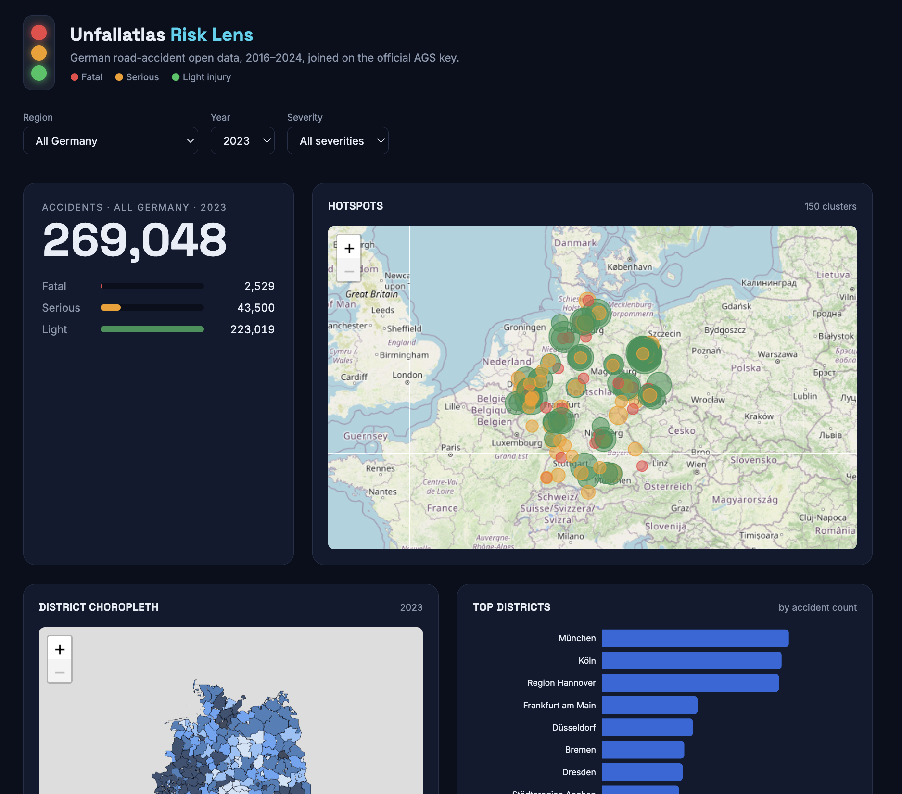
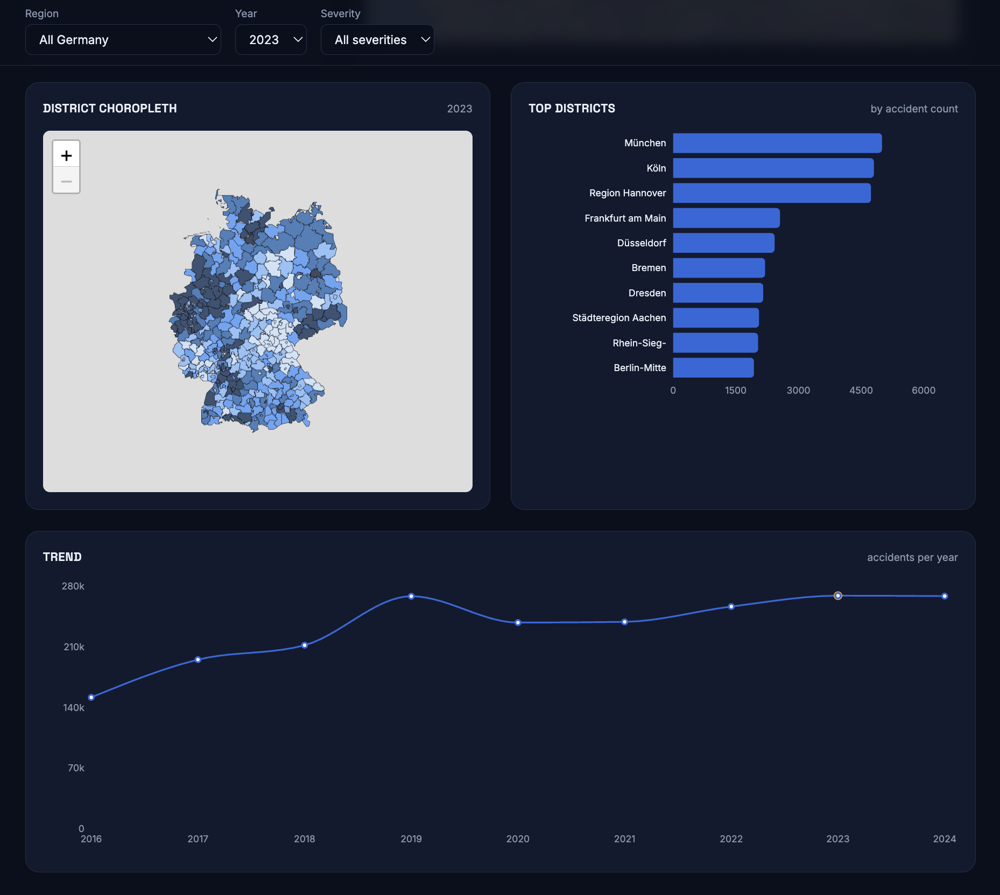

# Unfallatlas Risk Lens

**German Road Accident Open Data Platform** — integrates 2M+ accident records (2016–2024), regional statistics, and district boundary geometries into a single analytical platform with a REST API and interactive dashboard.

Built for the module *Datenbanken und Web-Techniken*.


---

## Features

- **2,098,019 accident records** from 9 annual Unfallatlas releases, harmonised via a column-variant resolution mechanism
- **Car data loaded for **2020–2024** across all ~400 German districts (~2,000 rows)
- **15-endpoint REST API** with OpenAPI/Swagger documentation, structured provenance in every response
- **Interactive dashboard** with hotspot maps, choropleth visualisation, ranking charts, and trend analysis
- **Multi-source queries** — e.g. accidents per 100,000 registered cars per district
- **Fully reproducible** — one command rebuilds the entire database from raw source files
- **15 automated quality checks** — coordinate validity, AGS integrity, referential integrity, duplicate detection

## Screenshots
 
### Dashboard Overview

 
### Choropleth & District Rankings


---

## Architecture

```
┌─────────────────────────────────────────────────────────────┐
│                        Raw Data Sources                     │
├─────────────────┬───────────────────┬───────────────────────┤
│  Unfallatlas    │   GENESIS 46251   │   Regionalstatistik   │
│  9 CSV files    │   Registered cars │   Per-10k rate        │
│  2016 – 2024    │   2020 – 2024     │   District GeoJSON    │
└────────┬────────┴─────────┬─────────┴───────────┬───────────┘
         │                  │                     │
         └──────────────────▼─────────────────────┘
                    ┌──────────────────────────┐
                    │  ETL Pipeline            │
                    ├──────────────────────────┤
                    │ · Auto-discover files    │
                    │ · Column-variant resolve │
                    │ · AGS key assembly       │
                    │ · Coordinate normalise   │
                    │ · Provenance recording   │
                    └───────┬──────────────────┘
                            │
                            ▼
                    ┌───────────────┐
                    │    SQLite     │
                    │   Database    │
                    ├───────────────┤
                    │ 6 tables      │
                    │ 2,098,019 rows│
                    │ AGS join key  │
                    └───────┬───────┘
                            │
                            ▼
                    ┌───────────────┐
                    │   FastAPI     │
                    │   REST API    │
                    ├───────────────┤
                    │ 15 endpoints  │
                    │ OpenAPI docs  │
                    │ Caching + CORS│
                    └───────┬───────┘
                            │
                            ▼
                    ┌───────────────┐
                    │    React      │
                    │   Dashboard   │
                    ├───────────────┤
                    │ Leaflet maps  │
                    │ Recharts      │
                    │ TypeScript    │
                    └───────────────┘
```
## Quick Start

### Option A: Docker Compose (recommended)

```bash
git clone https://github.com/[YOUR_USERNAME]/unfallatlas-risk-lens.git
cd unfallatlas-risk-lens

# Place your data files (see Data Setup below)

docker-compose up --build
```

- API: http://localhost:8000
- API docs: http://localhost:8000/docs
- Dashboard: http://localhost:5173

### Option B: Manual Setup

**Prerequisites:** Python 3.10+, Node.js 18+, npm

```bash
# 1. Clone and setup
git clone https://github.com/[YOUR_USERNAME]/unfallatlas-risk-lens.git
cd unfallatlas-risk-lens
python3 -m venv venv
source venv/bin/activate
pip install -r requirements.txt

# 2. Install frontend dependencies
cd src/frontend && npm install && cd ../..

# 3. Place data files (see below), then build the database
cd src
python -m etl.run_import
python -m etl.quality_checks    # optional: verify data integrity

# 4. Start API (Terminal 1)
uvicorn api.main:app --reload

# 5. Start frontend (Terminal 2)
cd src/frontend && npm run dev
```

## Data Setup

Place the following files before running the import:

| File | Location | Source |
|------|----------|--------|
| Unfallatlas CSVs (per year) | `data/raw/unfallatlas/{year}/` | [opengeodata.nrw.de](https://www.opengeodata.nrw.de/produkte/transport_verkehr/unfallatlas/) |
| Registered cars CSV | `data/raw/regional-stats/registered_cars_2023_2024.csv` | [GENESIS table 46251](https://www.regionalstatistik.de/genesis/online) |
| Per-10k accidents CSV | `data/raw/regional-stats/accident_per_10000_per_city.csv` | [Regionalstatistik](https://www.regionalstatistik.de/genesis/online) |
| District boundaries | `data/raw/boundaries/districts.geojson` | [OpenDataSoft](https://public.opendatasoft.com/explore/dataset/georef-germany-kreis/export/) |

**Quick download for district boundaries:**
```bash
curl -o data/raw/boundaries/districts.geojson \
  "https://public.opendatasoft.com/api/explore/v2.1/catalog/datasets/georef-germany-kreis/exports/geojson"
```

## API Endpoints
 
| # | Endpoint | Category | Description |
|---|---|---|---|
| 1 | `GET /` | Meta | Service index |
| 2 | `GET /health` | Meta | Liveness check |
| 3 | `GET /regions` | Regions | List regions by level or name |
| 4 | `GET /regions/choropleth` | GeoJSON | District polygons for choropleth maps |
| 5 | `GET /regions/{ags}` | Regions | Single region with indicator values |
| 6 | `GET /accidents` | List | Paginated individual accident rows |
| 7 | `GET /accidents/near` | Spatial | Accidents within radius of a point |
| 8 | `GET /aggregates/accidents` | Count | Total accident count for any filter |
| 9 | `GET /aggregates/accidents/by-region` | Ranking | Counts grouped by state/district |
| 10 | `GET /aggregates/rate` | Multi-source | Accidents per 100k cars/inhabitants |
| 11 | `GET /aggregates/hotspots` | Spatial | Severity-ranked crash clusters |
| 12 | `GET /stats/first-year` | Temporal | Earliest data year per state |
| 13 | `GET /stats/trend` | Trend | Accident counts per year |
| 14 | `GET /metadata/sources` | Provenance | Data sources and licences |
| 15 | `GET /import-runs` | Provenance | Import audit trail |
 
Full interactive documentation: `http://127.0.0.1:8000/docs`
 
---

### Example Queries

```bash
# How many fatal accidents in Sachsen in 2023?
curl "http://localhost:8000/aggregates/accidents?state=SN&year=2023&category=1"

# Top 5 districts by accident count in Bayern, 2023
curl "http://localhost:8000/aggregates/accidents/by-region?state=BY&year=2023&level=district&limit=5"

# Hotspots in Berlin, 2023, all severities
curl "http://localhost:8000/aggregates/hotspots?state=BE&year=2023&limit=10"

# Trend for Nordrhein-Westfalen, fatal only
curl "http://localhost:8000/stats/trend?state=NW&category=1"

# Choropleth GeoJSON for Sachsen, serious injuries, 2023
curl "http://localhost:8000/regions/choropleth?metric=count&year=2023&state=SN&category=2"
```

## Database Schema

Six tables centred on the `accidents` table, joined via the official AGS region key:

- **accidents** — 2M+ rows: severity, time, participant flags, coordinates, municipality AGS
- **regions** — hierarchical: country → state → district → municipality, with geometry column
- **indicators** / **indicator_values** — extensible time-varying stats (cars, per-10k rates)
- **data_sources** / **import_runs** — full provenance audit trail

## Dashboard

The React dashboard provides five analytical panels driven by a shared filter bar:

- **Headline** — total count with fatal/serious/light severity bars
- **Hotspot Map** — Leaflet map with severity-coloured crash clusters
- **Choropleth Map** — district polygons shaded by accident count
- **Top Districts** — horizontal bar chart ranking
- **Trend Line** — year-over-year accident count with selected year highlighted

## Data Quality

15 automated checks run via `python3 -m etl.quality_checks`:

```
[PASS] accidents table populated     (2,098,019 rows)
[PASS] years within 2016–2026        (2016–2024)
[PASS] coordinates inside Germany    (0 out of range)
[PASS] coordinates present           (0 missing)
[PASS] category in {1,2,3}
[PASS] month in 1–12
[PASS] hour in 0–23
[PASS] participant flags are 0/1     (0 bad)
[PASS] municipality_ags is 8 digits
[PASS] state prefix is 01–16        (0 bad)
[PASS] every accident linked to a region
[PASS] districts have a parent state
[WARN] no duplicate source ids       (212,692 duplicated)
[PASS] road_condition populated      (2,098,019 rows)
[PASS] districts have geometry       (400/516 covered)
─────────────────────────────────────────────────────
0 FAIL · 1 WARN · 14 PASS
```

The single WARN reflects overlapping annual releases in the source data, not an import error.

## Tech Stack

| Layer | Technology |
|-------|-----------|
| ETL | Python, SQLite |
| API | FastAPI, Uvicorn |
| Frontend | React 18, Vite, TypeScript, Tailwind CSS v4 |
| Maps | Leaflet |
| Charts | Recharts |
| Data licence | Datenlizenz Deutschland – Namensnennung 2.0 |

## Project Structure

```
unfallatlas-risk-lens/
├── data/
│   └── raw/
│       ├── aggregates/
│       │   └── accidents_with_persons_per_month.csv
│       ├── boundaries/
│       │   └── districts.geojson
│       └── regional-stats/
│           ├── accident_per_10000_per_city.csv
│           ├── registered_cars_2023.csv
│           └── registered_cars_2024_2021.csv
├── src/
│   ├── api/
│   │   └── main.py
│   ├── db/
│   │   └── schema.sql
│   ├── etl/
│   │   ├── check_questions.py
│   │   ├── config.py
│   │   ├── db.py
│   │   ├── demo.py
│   │   ├── load_accidents.py
│   │   ├── load_geometries.py
│   │   ├── load_indicators.py
│   │   ├── load_regions.py
│   │   ├── quality_checks.py
│   │   └── run_import.py
│   └── frontend/
│       ├── src/
│       │   ├── components/
│       │   │   ├── ChoroplethMap.tsx
│       │   │   ├── FilterBar.tsx
│       │   │   ├── Headline.tsx
│       │   │   ├── HotspotMap.tsx
│       │   │   ├── RankingChart.tsx
│       │   │   └── TrendChart.tsx
│       │   ├── lib/
│       │   │   ├── api.ts
│       │   │   ├── format.ts
│       │   │   ├── types.ts
│       │   │   └── useAsync.ts
│       │   └── App.tsx
│       ├── package.json
│       └── vite.config.ts
├── .gitignore
├── README.md
├── docker-compose.yml
└── requirements.txt
```

## Licence

The **source code** is provided for academic purposes as part of a university module submission.

All **data** is sourced from official German open data portals under the [Datenlizenz Deutschland – Namensnennung 2.0](https://www.govdata.de/dl-de/by-2-0) (dl-de/by-2-0), which permits free use and redistribution with attribution.
